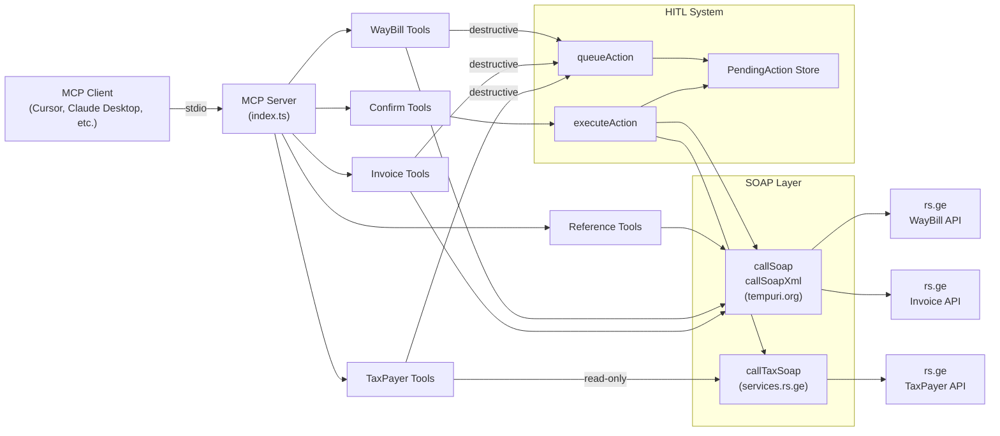
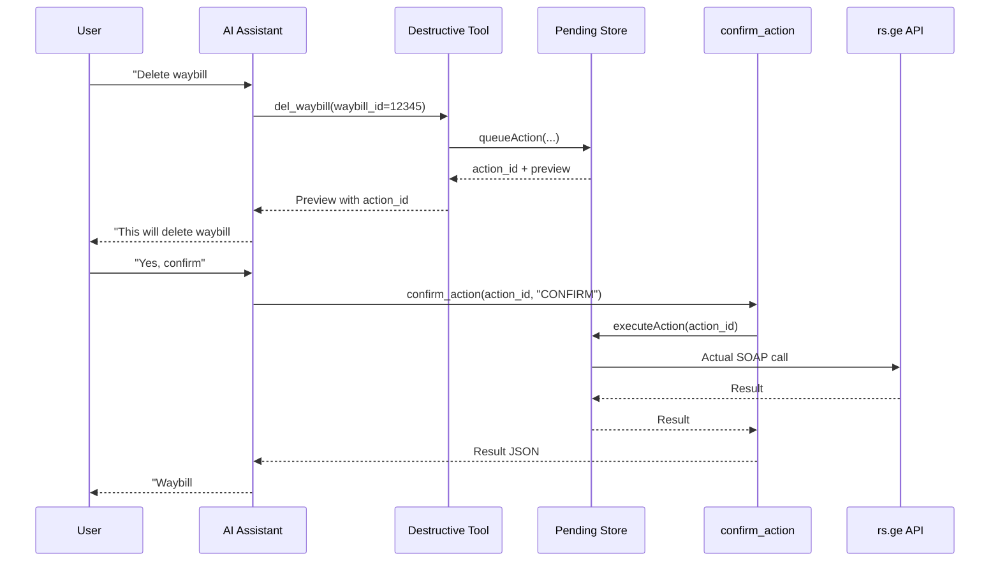

# rs-mcp

MCP (Model Context Protocol) server for Georgia's Revenue Service (rs.ge). Exposes WayBill, Invoice, and TaxPayer SOAP APIs as 87 AI-callable tools over stdio. Works with any MCP-compatible client -- [Cursor](https://cursor.sh), [Claude Desktop](https://claude.ai/download), [Windsurf](https://codeium.com/windsurf), [Continue](https://continue.dev), or any other agent/IDE that supports the MCP standard.

**Services covered:**

| Service | Endpoint | Tools |
|---------|----------|-------|
| WayBill | `services.rs.ge/WayBillService/WayBillService.asmx` | 24 |
| Invoice (NTOS) | `revenue.mof.ge/ntosservice/ntosservice.asmx` | 40 |
| TaxPayer | `services.rs.ge/taxservice/taxpayerservice.asmx` | 20 |
| Confirmation (HITL) | _(internal)_ | 3 |

**Key features:**

- Read-only queries for waybills, invoices, taxpayer info, reference data
- Full CRUD for waybills and invoices (create, send, confirm, reject, close, delete)
- Human-in-the-Loop (HITL) safety system for all destructive operations
- Automatic SOAP envelope construction and XML response parsing

---

## Prerequisites

- **Node.js** >= 18 (uses native `fetch`)
- **npm**
- **An MCP-compatible client** -- Cursor, Claude Desktop, Windsurf, Continue, or any agent/IDE that supports MCP
- **rs.ge service user account** (sub-user created through the rs.ge e-declaration portal)

---

## Quick Start

### 1. Clone and install

```bash
git clone <your-repo-url> rs-mcp
cd rs-mcp
npm install
```

### 2. Configure environment

Copy the example file and fill in your credentials:

```bash
cp .env.example .env
```

Edit `.env`:

```
RS_SU=your_username:your_tin
RS_SP=your_password
RS_BASE_URL=https://services.rs.ge/WayBillService/WayBillService.asmx
RS_INVOICE_URL=https://www.revenue.mof.ge/ntosservice/ntosservice.asmx
RS_USER_ID=0
RS_TAX_URL=https://services.rs.ge/taxservice/taxpayerservice.asmx
```

See [Environment Variables](#environment-variables) for details on each variable.

### 3. Build

```bash
npm run build
```

This compiles TypeScript from `src/` into `dist/`.

### 4. Connect to your MCP client

The server uses **stdio transport** -- your MCP client spawns the process and communicates over stdin/stdout. Configuration varies by client:

**Cursor** -- create `.cursor/mcp.json` in the project root:

```json
{
  "mcpServers": {
    "rs-mcp": {
      "command": "node",
      "args": ["dist/index.js"],
      "cwd": "/absolute/path/to/rs-mcp"
    }
  }
}
```

**Claude Desktop** -- edit `~/Library/Application Support/Claude/claude_desktop_config.json`:

```json
{
  "mcpServers": {
    "rs-mcp": {
      "command": "node",
      "args": ["/absolute/path/to/rs-mcp/dist/index.js"]
    }
  }
}
```

**Other clients** -- consult your client's MCP documentation. The server entry point is `node dist/index.js` with the working directory set to the project root.

> **Important:** Do NOT run `npm start` manually during normal use. Your MCP client spawns the server process itself. After making changes, rebuild with `npm run build` and restart the MCP server from your client's settings.

---

## Environment Variables

| Variable | Required | Description | Example |
|----------|----------|-------------|---------|
| `RS_SU` | Yes | Service username in `username:TIN` format | `myuser:123456789` |
| `RS_SP` | Yes | Service password | `MyPassword123` |
| `RS_BASE_URL` | No | WayBill SOAP endpoint (has default) | `https://services.rs.ge/WayBillService/WayBillService.asmx` |
| `RS_INVOICE_URL` | No | Invoice/NTOS SOAP endpoint (has default) | `https://www.revenue.mof.ge/ntosservice/ntosservice.asmx` |
| `RS_USER_ID` | Yes | Your e-declaration user ID (for invoice tools). Use `ntos_get_un_id_from_user_id` to find it. | `135184` |
| `RS_TAX_URL` | No | TaxPayer SOAP endpoint (has default) | `https://services.rs.ge/taxservice/taxpayerservice.asmx` |

`RS_SU` and `RS_SP` are shared across all three services. The WayBill and Invoice services auto-inject them as `su`/`sp`. The TaxPayer service passes them explicitly per method (credential parameter names vary by method).

---

## Project Structure

```
rs-mcp/
├── .cursor/
│   └── mcp.json              # MCP server configuration (Cursor-specific)
├── .env                       # Credentials (git-ignored)
├── .env.example               # Template for .env
├── .gitignore
├── package.json
├── tsconfig.json
└── src/
    ├── index.ts               # Entry point -- creates server, registers all tools
    ├── config.ts              # Loads environment variables
    ├── confirm.ts             # HITL pending-action store and execution logic
    ├── soap/
    │   ├── client.ts          # SOAP client for WayBill & Invoice (tempuri.org namespace)
    │   └── tax-client.ts      # SOAP client for TaxPayer (services.rs.ge namespace)
    ├── xml/
    │   ├── parser.ts          # XML-to-JSON parser (fast-xml-parser)
    │   └── waybill-builder.ts # Structured JSON to Waybill XML converter
    ├── tools/
    │   ├── reference.ts       # WayBill reference data (types, units, transport)
    │   ├── waybill.ts         # WayBill read/query tools
    │   ├── waybill-write.ts   # WayBill write tools (save, send, close, delete)
    │   ├── helpers.ts         # WayBill helper tools (TIN lookup, error codes)
    │   ├── invoice.ts         # Invoice CRUD and status management
    │   ├── invoice-query.ts   # Invoice listing and search
    │   ├── invoice-desc.ts    # Invoice goods lines and waybill linking
    │   ├── invoice-helpers.ts # Invoice lookups, excise, requests
    │   ├── taxpayer.ts        # TaxPayer info and lookups
    │   ├── taxpayer-reports.ts# TaxPayer reports and financial data
    │   ├── taxpayer-auth.ts   # TaxPayer 2-step SMS auth tools
    │   └── confirm.ts         # HITL confirmation/rejection tools
    └── types/
        ├── reference.ts       # WayBill reference data interfaces
        ├── waybill.ts         # WayBill data interfaces
        ├── invoice.ts         # Invoice data interfaces
        └── taxpayer.ts        # TaxPayer data interfaces
```

---

## Architecture



**Data flow:**

1. The MCP client sends a tool call via stdio
2. The MCP server routes it to the appropriate tool handler
3. **Read-only tools** call the SOAP client directly and return JSON
4. **Destructive tools** queue the action in the HITL store, return a preview, and wait for explicit user confirmation before executing

---

## Human-in-the-Loop (HITL) Safety System

All 32 destructive tools (create, update, delete, send, confirm, reject) use a two-phase confirmation system to prevent accidental data changes.

### How it works



### Key rules

- Pending actions **expire after 5 minutes**
- The AI **must show the preview** to the user and wait for explicit approval
- `confirm_action` requires `confirmation_text: "CONFIRM"` -- the AI cannot auto-confirm
- Use `reject_action` to cancel a queued action
- Use `list_pending_actions` to see all actions awaiting confirmation

### HITL tools

| Tool | Description |
|------|-------------|
| `confirm_action` | Execute a queued destructive action (requires explicit user approval) |
| `reject_action` | Cancel a queued destructive action |
| `list_pending_actions` | List all pending actions with remaining time |

---

## Tool Reference

### WayBill Reference (5 tools)

Fetch reference/lookup data for waybill fields. All read-only, no parameters required.

| Tool | Description |
|------|-------------|
| `get_waybill_types` | List all waybill types |
| `get_waybill_units` | List all measurement units |
| `get_trans_types` | List all transport types |
| `get_akciz_codes` | List all excise/akciz codes |
| `get_wood_types` | List all wood types |

---

### WayBill Read (6 tools)

Query and filter waybills. All read-only.

| Tool | Description | Key Parameters |
|------|-------------|----------------|
| `get_waybill` | Get a single waybill by ID | `waybill_id` |
| `get_waybills` | List seller waybills with filters | `types`, `buyer_tin`, `statuses`, `create_date_s/e`, `begin_date_s/e` |
| `get_buyer_waybills` | List buyer waybills with filters | `types`, `seller_tin`, `statuses`, `create_date_s/e`, `begin_date_s/e` |
| `get_waybills_v1` | List waybills by last-update date range (max 3-day span) | `last_update_date_s`, `last_update_date_e`, `buyer_tin` |
| `get_waybills_ex` | Seller waybills with confirmation filter | Same as `get_waybills` + `is_confirmed` (0/1/-1) |
| `get_buyer_waybills_ex` | Buyer waybills with confirmation filter | Same as `get_buyer_waybills` + `is_confirmed` (0/1/-1) |

**Waybill statuses:** `0`=saved, `1`=active, `2`=closed, `8`=sent to transporter, `-1`=deleted, `-2`=cancelled

---

### WayBill Write (9 tools)

Create, activate, close, and manage waybills. All destructive (HITL-protected).

| Tool | Description | Key Parameters |
|------|-------------|----------------|
| `save_waybill` | Create or update a waybill | `type`, `buyer_tin`, `buyer_name`, `start_address`, `end_address`, `driver_tin`, `driver_name`, `goods_list[]`, `trans_id`, `begin_date`, `status` |
| `send_waybill` | Activate a saved waybill | `waybill_id` |
| `send_waybill_vd` | Activate with a specific begin date | `waybill_id`, `begin_date` |
| `confirm_waybill` | Buyer confirms receipt of goods | `waybill_id` |
| `reject_waybill` | Buyer rejects a waybill | `waybill_id` |
| `close_waybill` | Close/complete a waybill | `waybill_id` |
| `close_waybill_vd` | Close with a specific delivery date | `waybill_id`, `delivery_date` |
| `del_waybill` | Delete a saved (not yet activated) waybill | `waybill_id` |
| `ref_waybill` | Cancel an active waybill | `waybill_id` |

**Waybill types:** `1`=inner, `2`=transportation, `3`=without transport, `4`=distribution, `5`=return, `6`=sub-waybill

**Goods list item fields:** `w_name`, `unit_id`, `quantity`, `price`, and optionally `unit_txt`, `bar_code`, `a_id`, `vat_type`, `quantity_ext`

---

### WayBill Helpers (4 tools)

Utility tools for waybill-related lookups. All read-only.

| Tool | Description | Key Parameters |
|------|-------------|----------------|
| `get_name_from_tin` | Look up a taxpayer name by TIN | `tin` |
| `get_error_codes` | List all waybill error codes | _(none)_ |
| `chek_service_user` | Verify service user credentials | _(none)_ |
| `get_service_users` | List all service users for the account | _(none)_ |

---

### Invoice CRUD & Status (12 tools)

Create, manage, and control invoice lifecycle. 8 destructive + 4 read-only.

| Tool | Type | Description | Key Parameters |
|------|------|-------------|----------------|
| `save_invoice` | Write | Save/create a tax invoice | `invois_id` (0=new), `operation_date`, `seller_un_id`, `buyer_un_id` |
| `save_invoice_n` | Write | Save/create with comment | Same + `note` |
| `save_invoice_a` | Write | Save/create advance/compensation invoice | Same as `save_invoice` |
| `get_invoice` | Read | Get a single invoice by ID | `invois_id` |
| `change_invoice_status` | Write | Change invoice status | `inv_id`, `status` |
| `acsept_invoice_status` | Write | Accept/confirm an invoice | `inv_id`, `status` |
| `ref_invoice_status` | Write | Reject an invoice with reason | `inv_id`, `ref_text` |
| `k_invoice` | Write | Create a correction invoice | `inv_id`, `k_type` (1-4) |
| `get_makoreqtirebeli` | Read | Get correction invoice ID | `inv_id` |
| `add_inv_to_decl` | Write | Attach invoice to VAT declaration | `seq_num`, `inv_id` |
| `get_seq_nums` | Read | Get declaration numbers by period | `sag_periodi` (e.g. "202404") |
| `get_decl_date` | Read | Get declaration date | `decl_num`, `un_id` |

**Invoice statuses:** `-1`=deleted, `0`=saved, `1`=sent, `2`=confirmed, `3`=corrected-primary, `4`=correction, `5`=correction-sent, `6`=cancelled-sent, `7`=cancellation-confirmed, `8`=correction-confirmed

**Correction types (`k_type`):** `1`=cancel operation, `2`=change operation type, `3`=price/compensation change, `4`=goods return

---

### Invoice Query (9 tools)

Search and list invoices. All read-only.

| Tool | Description | Key Parameters |
|------|-------------|----------------|
| `get_seller_invoices` | List seller-side invoices | `un_id`, date filters (`s_dt`/`e_dt`, `op_s_dt`/`op_e_dt`), `invoice_no`, `sa_ident_no` |
| `get_buyer_invoices` | List buyer-side invoices | Same as above |
| `get_user_invoices` | List by last-update date (max 3-day span) | `un_id`, `last_update_date_s/e` |
| `get_seller_invoices_r` | Seller invoices needing reaction | `un_id`, `status` |
| `get_buyer_invoices_r` | Buyer invoices needing reaction | `un_id`, `status` |
| `get_invoice_numbers` | Autocomplete invoice numbers | `un_id`, `v_invoice_n`, `v_count` |
| `get_invoice_tins` | Autocomplete buyer/seller TINs | `un_id`, `v_invoice_t`, `v_count` |
| `get_invoice_d` | Autocomplete declaration numbers | `un_id`, `v_invoice_d`, `v_count` |
| `print_invoices` | Get invoice data for printing | `inv_id` |

---

### Invoice Goods & Links (6 tools)

Manage goods line items and waybill links on invoices. 4 destructive + 2 read-only.

| Tool | Type | Description | Key Parameters |
|------|------|-------------|----------------|
| `save_invoice_desc` | Write | Save a goods/service line item | `invois_id`, `goods`, `g_unit`, `g_number`, `full_amount`, `drg_amount` |
| `get_invoice_desc` | Read | Get all line items for an invoice | `invois_id` |
| `delete_invoice_desc` | Write | Delete a line item | `id`, `inv_id` |
| `get_ntos_invoices_inv_nos` | Read | Get waybills linked to an invoice | `invois_id` |
| `save_ntos_invoices_inv_nos` | Write | Link a waybill to an invoice | `invois_id`, `overhead_no`, `overhead_dt` |
| `delete_ntos_invoices_inv_nos` | Write | Unlink a waybill from an invoice | `id`, `inv_id` |

**VAT amount (`drg_amount`):** positive = normal VAT, `0` = zero-rate, `-1` = non-taxable

---

### Invoice Helpers (13 tools)

Lookups, excise codes, service users, and invoice requests. 3 destructive + 10 read-only.

| Tool | Type | Description | Key Parameters |
|------|------|-------------|----------------|
| `ntos_get_un_id_from_tin` | Read | Get unique ID from TIN | `tin` |
| `ntos_get_tin_from_un_id` | Read | Get TIN from unique ID | `un_id` |
| `ntos_get_org_name_from_un_id` | Read | Get org name from unique ID | `un_id` |
| `ntos_get_un_id_from_user_id` | Read | Get unique ID from e-declaration user ID | _(none)_ |
| `ntos_get_akciz` | Read | Search excise/akciz codes | `s_text` |
| `ntos_chek` | Read | Verify NTOS service credentials | _(none)_ |
| `ntos_get_ser_users` | Read | List NTOS service users | `user_name`, `user_password` |
| `save_invoice_request` | Write | Create invoice issuance reminder | `inv_id`, `bayer_un_id`, `seller_un_id`, `dt` |
| `del_invoice_request` | Write | Delete an invoice reminder | `inv_id`, `bayer_un_id` |
| `get_invoice_request` | Read | Get reminder details | `inv_id` |
| `acsept_invoice_request_status` | Write | Forward invoice request to seller | `id`, `seller_un_id` |
| `get_requested_invoices` | Read | List requests received by seller | `seller_un_id` |
| `get_invoice_requests` | Read | List requests sent by buyer | `bayer_un_id` |

---

### TaxPayer Info (8 tools)

Query taxpayer information and lookups. All read-only.

| Tool | Description | Key Parameters |
|------|-------------|----------------|
| `tax_get_tp_info_public` | Public taxpayer info (name, legal form, status, VAT, address) | `tp_code` |
| `tax_get_tp_contacts` | Taxpayer contact info (phone, email) | `tp_code` |
| `tax_get_payer_info` | Comprehensive payer info (status, declarations, waybills, cash box) | `said_code` |
| `tax_get_legal_person_info` | Legal entity details (name, form, address, responsible persons) | `said_code` |
| `tax_get_person_income_data` | Person income data (yearly/monthly amounts) | `personal_number` |
| `tax_get_payer_nace_info` | NACE activity codes for a taxpayer | `said_code` |
| `tax_get_income_amount` | Joint/total income amount for a year | `year` |
| `tax_get_payer_info_gita` | GITA payer info with financial data | `payer_code`, `start_date`, `end_date` |

> **Note:** Some TaxPayer methods may require additional service activation or 2-step SMS verification on your sub-user account. Methods that return "authorization error" likely need activation through the rs.ge portal.

---

### TaxPayer Reports (8 tools)

Financial reports and customs data. 7 read-only + 1 destructive.

| Tool | Type | Description | Key Parameters |
|------|------|-------------|----------------|
| `tax_get_z_report_sum` | Read | Z-report cash register totals | `start_date`, `end_date` |
| `tax_get_z_report_details` | Read | Z-report per-device details | `start_date`, `end_date` |
| `tax_get_waybill_month_amount` | Read | Monthly waybill amounts | `said_code`, `start_date`, `end_date` |
| `tax_get_quick_cash_info` | Read | Financial dashboard overview | _(none)_ |
| `tax_get_comp_act_old` | Read | Comparison act (old format) | `said_code`, `start_date`, `end_date` |
| `tax_get_comp_act_new` | Read | Comparison act (new format) | `said_code`, `start_date`, `end_date` |
| `tax_get_cargo200_info` | Read | Cargo 200 customs information | `start_date`, `end_date` |
| `tax_customs_warehouse_exit` | Write | Register customs warehouse exit | `declaration_number`, `customs_code`, `car_number` |

---

### TaxPayer Auth (4 tools)

SMS-based 2-step authentication for sensitive TaxPayer operations. 2 read-only + 2 destructive.

| Tool | Type | Description | Key Parameters |
|------|------|-------------|----------------|
| `tax_tp_sms_verification` | Read | Verify SMS code for payer info auth | `said_code`, `sms_code` |
| `tax_gita_sms_verification` | Read | Verify SMS code for GITA payer info auth | `payer_code`, `sms_code` |
| `tax_payer_info_activation` | Write | Activate/deactivate payer info access | `said_code`, `status` (1=activate, 0=deactivate) |
| `tax_gita_payer_activation` | Write | Activate GITA payer info access | `payer_code`, `start_date`, `status` |

---

## SOAP Services Reference

The server communicates with three rs.ge SOAP endpoints:

### WayBill Service

- **Endpoint:** `https://services.rs.ge/WayBillService/WayBillService.asmx`
- **Namespace:** `http://tempuri.org/`
- **Auth:** `su` (username:TIN) and `sp` (password) auto-injected into every request
- **Client:** `src/soap/client.ts` -- `callSoap()` and `callSoapXml()`

### Invoice Service (NTOS)

- **Endpoint:** `https://www.revenue.mof.ge/ntosservice/ntosservice.asmx`
- **Namespace:** `http://tempuri.org/`
- **Auth:** Same `su`/`sp` credentials, plus `user_id` injected for most methods
- **Client:** Same `callSoap()` with custom `baseUrl`

### TaxPayer Service

- **Endpoint:** `https://services.rs.ge/taxservice/taxpayerservice.asmx`
- **Namespace:** `services.rs.ge`
- **Auth:** Credentials passed explicitly per method (parameter names vary: `UserName`, `userName`, `inUserName`, `user`)
- **Client:** `src/soap/tax-client.ts` -- `callTaxSoap()`

---

## Development

### Build

```bash
npm run build    # Compiles TypeScript to dist/
```

### Run standalone (for debugging)

```bash
npm start        # Runs node dist/index.js
```

> For normal use, don't run manually -- your MCP client spawns the process.

### Tech stack

- **TypeScript** with strict mode, ES2022 target, Node16 module resolution
- **ES Modules** (`"type": "module"` in package.json)
- **@modelcontextprotocol/sdk** -- MCP server framework
- **zod** -- Input schema validation
- **fast-xml-parser** -- XML response parsing
- **dotenv** -- Environment variable loading

### Adding new tools

1. Create a tool file in `src/tools/` (or add to an existing one)
2. Define tools using `server.tool(name, description, schema, annotations, handler)`
3. Use `READONLY` or `DESTRUCTIVE` annotations:
   ```typescript
   const READONLY = { readOnlyHint: true, destructiveHint: false } as const;
   const DESTRUCTIVE = { readOnlyHint: false, destructiveHint: true } as const;
   ```
4. For destructive tools, use `queueAction()` instead of calling SOAP directly
5. Export a `register*Tools(server: McpServer)` function
6. Import and call it in `src/index.ts`
7. Rebuild with `npm run build`

### Adding a new SOAP service

1. Add endpoint URL to `src/config.ts` and `.env`/`.env.example`
2. Create a SOAP client in `src/soap/` if the service uses a different namespace
3. Create type interfaces in `src/types/`
4. Create tool files in `src/tools/`
5. If the service has destructive operations, extend `src/confirm.ts` if needed

---

## License

ISC
